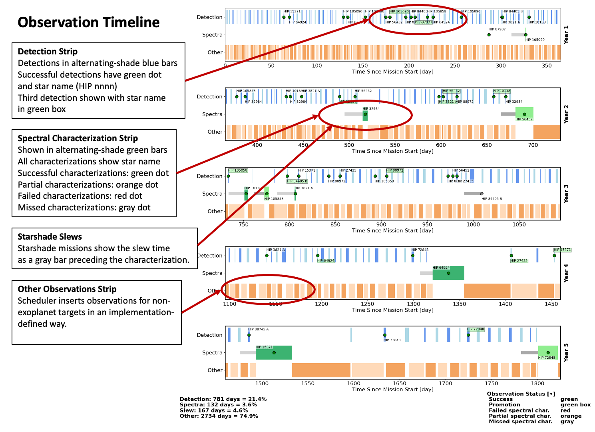

Title: Observation Timelines

# Observation Timelines

We make plots of observations (integration intervals) versus time, 
across the whole mission.

[{: width="100%" }](Media/annotated-obs-timeline.png)

## Plot Format

Mission elapsed time is along the x-axis, and observation
type is on the y-axis.
The latter can be Detection, Spectral Characterization, or Other observations
such as general astrophysics.
We can show 5 years on one page, and further years appear on separate pages.

In general, we are showing available integration intervals.

## Detections

Detection observations are shown in alternating shades of blue.
The two shades have no intrinsic meaning, it is just a mechanism
to prevent a series of back-to-back observations from blurring 
together.

Many detections do not find a planet, but the ones that do are 
shown as a green dot with the corresponding star name in a 
small text box.
If this is the third successful detection, the star name is shown
in a green box to indicate it could be a promotion target
(depending on script settings).
Boxes alternate above and below the centerline to minimize
overprinting.

Detections that do not find a planet do not receive a dot.

## Spectral Characterizations

Much like Detections, Characterizations are shown by
alternating green bars with text boxes.
Text boxes alternate above and below the centerline to minimize
overprinting.
Being relatively sparse, more information can be provided, as follows:

| Dot Color       | Short Name | Description |
| ----------- | ----------- | ----------- |
| Green    | Success|  Successful  characterization (full spectrum)    |
| Orange  | Partial | Partial characterization (IWA/OWA issue)       |
| Red       | Fail | Failed characterization (poor SNR) |
| Gray | Miss | Missed characterization (e.g., unexpected keepout violation) |

Missed characterizations can happen 
due to a scheduler problem in which an observation
is attempted that has a keepout conflict.

## General Astrophysics

Depending on mission configuration, general astrophysics (GA)
observations may be shown in orange underneath exoplanet-related
observations. 
GA observations must not overlap the other observation types.
They are interleaved using an arbitrary scheduler-dependent mechanism.

## Slews

Missions with a starshade will have narrower gray bars, 
representing slew intervals, appearing
ahead of the green bars for spectral
characterization.
Detection and general astrophysics observations may take
place concurrently with slews.
