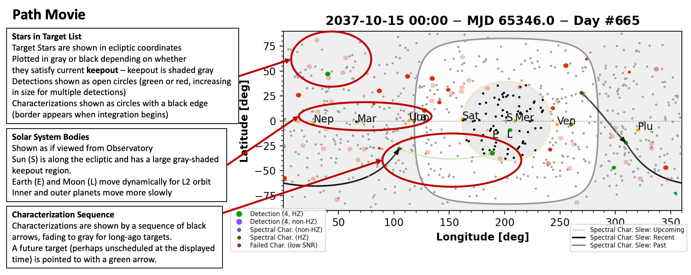

Title: Path Movie

# Path Movies

This describes the format of the path movies that 
are made in the EXOSIMS sandbox.
These movies are animations showing the target list, keepout regions, 
the detection-mode observations, and the observations made
for spectral characterization.

[{: width="100%" }](Media/annotated-path-movie.png)

## Coordinates

The plot coordinate system is ecliptic and shows the view from the observatory.
Solar system bodies (Sun, Earth, Moon, and other planets) are shown as labeled gold
points. 
The Sun (marked with +) is always within the ecliptic plane (at zero latitude) 
with a keepout region (a disk or annulus) centered about it.

Earth and the Moon (marked L for Luna), close to the observatory, 
move very dynamically, while the inner planets move less dynamically, 
and the outer planets move slowly.

## Stars and the Target List

The target list is shown as gray or black points in the ecliptic coordinate system.
Stars within this list are marked in red, green, or purple as their planets are detected.
We are mostly focused on observations resulting in series of detections, so the 
number of detections is encoded in the size of the green (or purple, or red) dot.
These detections occur sporadically but must obey keepout.

Depending on various conditions (such as prior planet detections), 
a target may be scheduled for spectral characterization.
Spectral characterizations are indicated by the sequence of 
arrows - black for the most recent, and fading to gray as the
characterization is older.

When the characterization is scheduled, a starshade will begin slewing
into position. When the slew begins, a light green arrow will be drawn in
the plot. When the slew ends and spectral characterization begins,
the arrow will change to black.

## Keepout

Keepout is shown by the gray overlay on the plot.
Starshades will have an annulus-shaped region of locations that
obey solar keepout, with further restrictions from planets.
Coronagraph-only systems (or detection-mode observations within
hybrid systems) have a disc-shaped keepout region centered on
the Sun.

