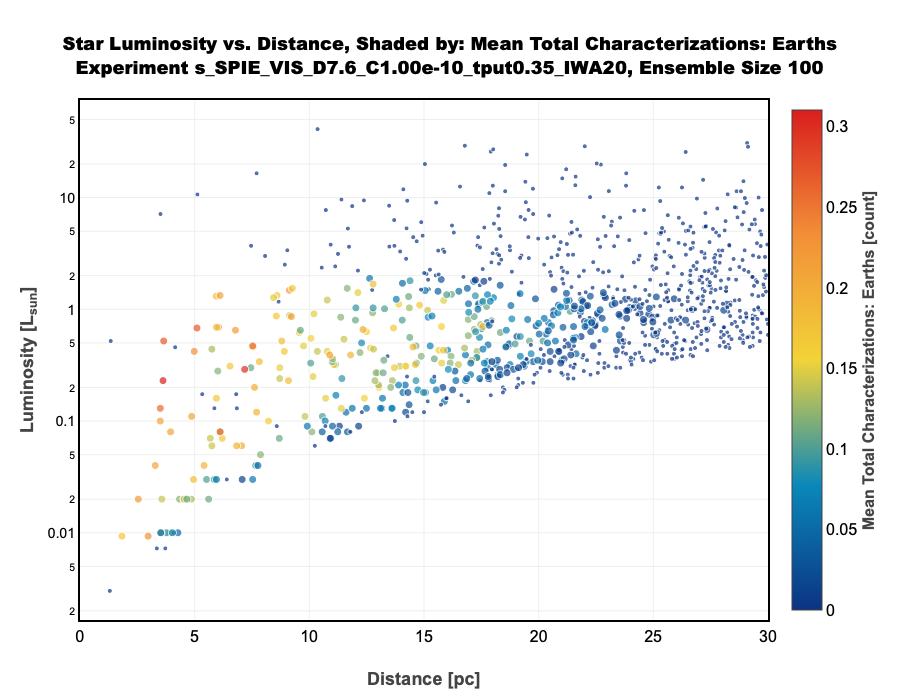
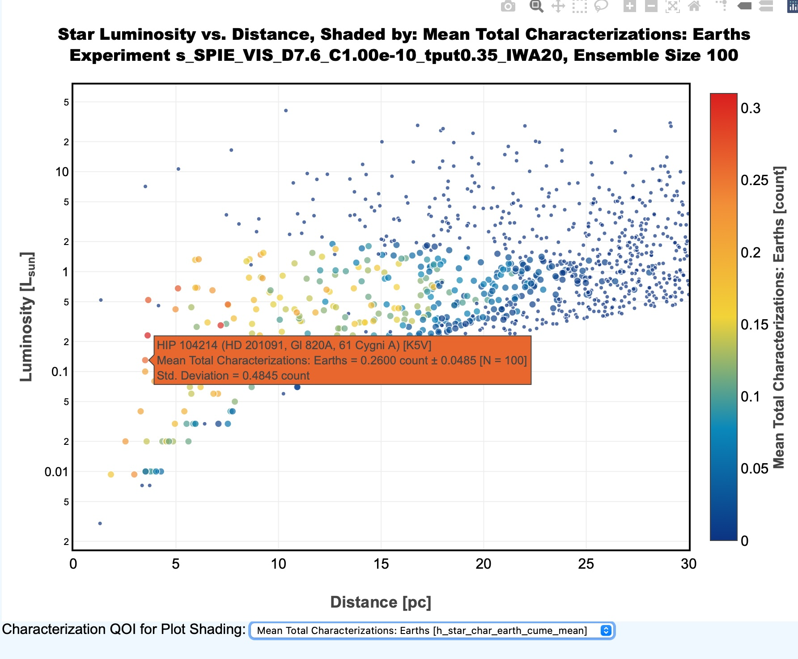

Title: Per-Star Metrics

# Per-Star Metrics Plot

This is a "per-star" plot that shows metrics for individual stars,
averaged over the ensemble.
Each star appears as a point in distance-luminosity coordinates.
Various star-by-star metrics can be chosen 
as shading and tooltips within the scatter plot.

[{: width="50%" }](Media/star-obs-char-cume.png)

There is one plot panel for detections and one for 
spectral characterizations -- this page describes both.
Generally the two panels have available parallel quantities
for detections versus characterizations.

## Format

The "QOI," or Quantity of Interest, is chosen from a dropdown menu.
Each QOI is a scalar that is used to color the point corresponding to 
a given star, and to display on tooltips upon the point.

Stars are shown
in a scatterplot format, with distance on x and luminosity on y.
Points come in two sizes: larger points correspond to stars that 
were observed at least once in the ensemble, and smaller points
are in the target list but were not observed.

Different QOIs have different colorbars, and units are given
next to the colorbar.
In general,
QOIs involving integration time are shown on a log (base 10)
scale.
Not-a-numbers will be shown in gray. For instance, the 
cumulative integration time of an unobserved star is 0, 
and the log of this is taken to be a not-a-number and
shown in gray.

## Tooltips

[{: width="50%" }](Media/star-obs-tooltip.png)

Brushing your cursor over the points indicating stars puts
up a panel showing: 

- Hipparcos name, with: (other alternative names in parentheses)

- Stellar class, in []

- QOI mean value: always a mean M *over the ensemble*

- The standard error of this mean value (M &plusmn; SE)

- Ensemble size N

- Standard standard deviation S (over the ensemble)

The standard error (SE) quantities after &plusmn; are the 
[standard error of the mean](https://en.wikipedia.org/wiki/Standard_error).
That is, SE is the population standard deviation S divided by
the square root of ensemble size (SE = S/&radic;N), so SE will drop to zero
as ensemble size N grows. 
The intent is to show how accurate the shown average is.

Note that some QOIs are not computable for every 
ensemble member, and this is accounted for correctly in
the displayed mean M and the ensemble size N.

For instance, the QOI "Earths Characterized/Earths Present"
is not defined (0/0) for ensemble members with no
Earthlike planet around that target star.
So, depending on &eta;-Earth, 
a 100-member ensemble might have only 21 values of this
QOI to average, and the tooltip will reveal the relevant N = 21, 
so that the uncertainty of the underlying average will be more clear.

## Quantities of Interest

We emphasize that all quantities are *averages over the ensemble* 
of the indicated metric (or QOI).

Thus, reported QOIs are always a mean value, but we do not repeat this
in the description.

So, "Detection Visits" should be interpreted as,
"mean value, over the N-member ensemble, of the number of detection visits 
to that star."

### Detection Panel

| QOI Name      | Unit | Short Name | Description |
| ------------- | ---- | ---------- | ----------- |
|  Completeness |  count | `det_comp_mean` | First-visit completeness (det. obs. mode) |
|  Total Detections: Earths |  count | `det_earth_cume_mean` | Includes repeat visits |
|  Earths Detected/Earths Present |  count/count | `det_earth_frac_mean` | Mean of: (successful/present) &le; 1 |
|  Unique Detections: Earths |  count | `det_earth_uniq_mean` | Repeat visits uncounted |
|  Earth Detection Rank |  count/day | `det_earth_value_mean` | Detections/Integration time |
|  Total Detections |  count | `det_plan_cume_mean` | Includes repeat visits |
|  Planets Detected/Planets Present |  count/count | `det_plan_frac_mean` | Mean of: (successful/present) &le; 1 |
|  Unique Detections |  count | `det_plan_uniq_mean` | Repeat visits uncounted |
|  Detection Rank |  count/day | `det_plan_value_mean` |Mean of: (detections/integration time) |
|  One-visit Integ. Time |  day | `det_tIntAvg_mean` | Average single-visit integration time |
|  Cumulative Integ. Time |  day | `det_tInt_mean` | Total time spent on detection |
|  First Observation Time |  day | `det_tobs1_mean` | Mission time of first detection visit |
|  Detection Visits |  count | `det_visit_mean` | Visits or revisits to the star |
|  Earths per Star |  count | `earth_per_star_mean` | Earthlike planet count |
|  Planets per Star |  count | `plan_per_star_mean` | Planet count|
|  Promotion Rate: Stars with Earths |  count | `promo_earth_mean` | Fraction promoted when hosting Earthlike planet |
|  Promotion Rate: Stars with HZ Planets |  count | `promo_hzone_mean` | Fraction promoted when hosting HZ planet |
|  Promotion Rate |  count | `promo_allplan_mean` | Fraction of missions where the star was promoted |
|  Earths per Star |  count | `earth_per_star_mean` | Earthlike planet count |
|  Planets per Star |  count | `plan_per_star_mean` | Planet count |

### Characterization Panel

| QOI Name      | Unit | Short Name | Description |
| ------------- | ---- | ---------- | ----------- |
|  Completeness |  count | `char_comp_mean` | First-visit completeness (char. obs. mode) |
|  Total Characterizations: Earths |  count | `char_earth_cume_mean` | Includes repeat visits |
|  Earths Characterized/Earths Present |  count/count | `char_earth_frac_mean` | Mean of: (successful/Earth present) &le; 1 |
|  Unique Characterizations: Earths |  count | `char_earth_uniq_mean` | Repeat visits uncounted |
|  Earth Characterization Rank |  count/day | `char_earth_value_mean` | Mean of: (yield/cume. int. time) |
|  Total Characterizations |  count | `char_plan_cume_mean` | Includes repeat visits |
|  Planets Characterized/Planets Present |  count/count | `char_plan_frac_mean` | Mean of: (successful char./planet present) |
|  Unique Characterizations |  count | `char_plan_uniq_mean` | Repeat visits uncounted |
|  Characterization Rank |  count/day | `char_plan_value_mean` | Mean of: (char. yield/cume. int. time) |
|  One-visit Integ. Time |  day | `char_tIntAvg_mean` | Average single-visit integration time |
|  Cumulative Integ. Time |  day | `char_tInt_mean` | Total time spent on characterization |
|  First Observation Time |  day | `char_tobs1_mean` | Mission time of first characterization visit |
|  Characterization Visits |  count | `char_visit_mean` | Visits or revisits to the star |
|  Earths per Star |  count | `earth_per_star_mean` | Earthlike planet count |
|  Planets per Star |  count | `plan_per_star_mean` | Planet count |

### Notes

Notes on specific metrics:

- For detection and characterization, the completeness is constant across the ensemble.

- "Rank" metrics (both characterization and detection) are 
patterned after the typical scheduler prioritization
of yield divided by integration time.
They are the ensemble average of the number of 
successful observations, divided by the cumulative integration
time (see below) spent on that observation.

- The "cumulative integration time" is the
_ensemble mean_ of the cumulative time spent across all 
detection (resp., characterization) observations on that star. 
This metric measures how much time overall we spend on a particular star.

- The "one-visit integration time" is the _ensemble mean_ of
the _per-DRM mean_ of the time spent collecting light across 
all detection (resp., characterization) visits to that star
(successful or not).
This metric measures how long we typically integrate on a single
visit to the star.

- "First observation time" is a tool to reveal stars
we typically observe early in the mission, or stars
we only get to much later on.

- "Detected/Present" metrics are responsive to observing system and
scheduler efficiency: are we able to find planets around this star?

- "Planets per Star" and "Earths per Star" are not a function of observing 
system. They are present to allow a check of the `SimulatedUniverse`.

### Provenance

The values of these metrics 
can be refreshed by just reducing the data (`make ... reduce`)
and re-loading the webpage.

They are computed in `reduce_drms.py:per_star_yield()`, 
which writes the averages to `reduce-star-target.csv`, which is in turn picked up
by a JavaScript loader within `star-target-plots.js`.
