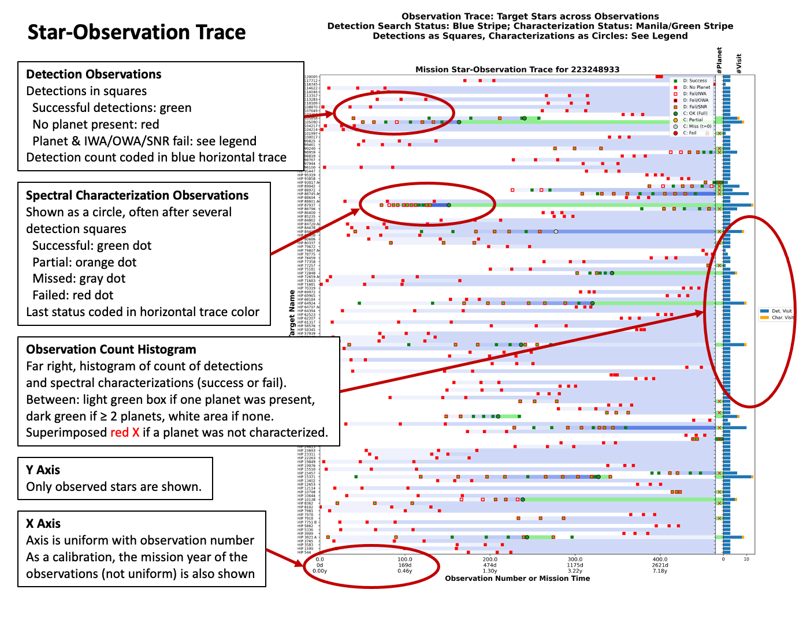

Title: Star-Observation Trace

# Star-Observation Trace Plot

This is a compact time-versus-target plot that 
is useful for diagnosing scheduling issues.

[{: width="100%" }](Media/annotated-star-obs-trace.png)

## Format

The y-axis shows targets ordered alphabetically.
Only targets that were observed during that mission
are shown.

The x-axis of the main plot (left area) 
is uniformly spaced in observation number
(detection or spectral characterization).
A companion scale shows mission elapsed time at
each major division of the observation number. 
Observations are denser early in the mission, so the
year scale is nonuniform.

## Observations

Each observation (detection or spectral characterization)
is represented by one marker in the plot:

| Marker        | Short Name | Description |
| ----------- | ----------- | ----------- |
| Green box   | Planet detected|  Successful detection of a planet   |
| Green box, red edge   | Planet present, undetected |  Missed detection due to poor SNR or WA   |
| White box, red edge   | No planet present|  Detection observation with no planet present    |
| Green circle  | Full | Full spectral characterization       |
| Orange circle | Partial | Partial characterization (IWA/OWA issue)       |
| Red circle      | Fail | Failed characterization (poor SNR) |
| Gray circle | Miss | Missed characterization (e.g., unexpected keepout violation) |

## Observation Trace

A horizontal stripe in ascending colors 
shows a progression of detection
observations of that star, and perhaps its conversion into a spectral
characterization.
The color value increases for each detection (successful or not).
After a characterization is attempted, the color of the stripe
changes to match the characterization status.

If a further detection is attempted, the stripe color resets.

## Secondary Plots

Two other, narrower plots are appended at the right.

The first plot (headed by a ``#Planet'' title)
shows the number of planets
around the star (blank for no planets).
A red X marks stars that did have one or more planets
but in which those planets were not characterized.
(As noted, only stars that were observed are in the plot,
so other planets may be present around stars not 
appearing in the plot.)

The rightmost sub-plot gives a histogram of the number
of detection (in blue)
and characterization (in yellow) 
visits (whether successful or not). 

The optimal appearance in these subplots
is a green box, without a red X, and a short histogram
of three stacked detections and one characterization.
The lack of a red X means that the characterization was 
successful.
