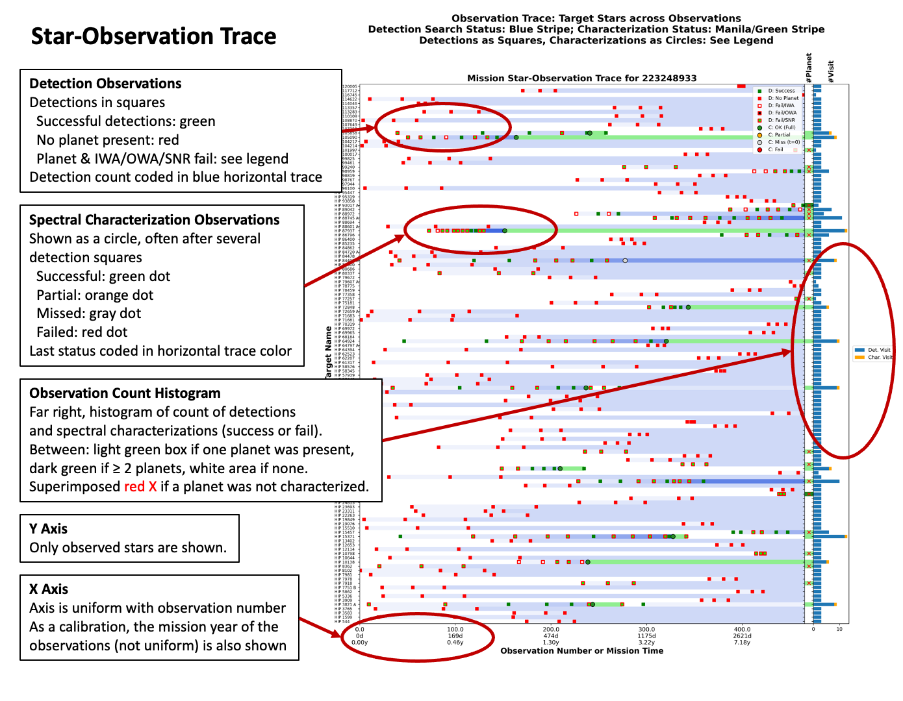

Title: Star-Observation Trace

# Star-Observation Trace Plot

This is a compact time-versus-target plot that 
is useful for diagnosing scheduling issues.

[{: width="100%" }](Media/annotated-star-obs-trace.png)

## Format

The y-axis shows targets ordered alphabetically.
Only targets that were observed during that mission
are shown.

The x-axis of the main plot (left area) 
is uniformly spaced in observation number
(detection or spectral characterization).
A companion scale shows mission elapsed time at
each major division of the observation number. 
Observations are denser early in the mission, so the
year scale is nonuniform.

## Observations

Each observation (detection or spectral characterization)
is represented by one marker in the plot:

| Marker        | Short Name     | Description |
| ------------- | -------------- | ----------- |
| Green box     | Success           | Successful detection of a planet |
| Red box, solid        | No planet | No planet exists at this star |
| Red box, green center | Fail/SNR  | Planet present, missed detection: SNR too low |
| Red box, white center | Fail/IWA  | Planet present, missed detection: inside IWA  |
| Red box, black center | Fail/OWA  | Planet present, missed detection: outside OWA |
| Green circle  | Full | Full spectral characterization       |
| Orange circle | Partial | Partial characterization (IWA/OWA issue)       |
| Red circle    | Fail | Failed characterization (poor SNR) |
| Gray circle   | Miss | Missed characterization (e.g., unexpected keepout violation) |

When there is more than one planet at the star, the most successful
outcome sets the color of the marker. For example, if one planet is detected and
another was inside IWA, the detected planet "wins" and a green box is shown.
Similarly, full characterizations "win" over partial or failed characterizations
of another planet around that star.

## Observation Trace

A horizontal stripe in ascending colors 
shows a progression of detection
observations of that star, and perhaps its conversion into a spectral
characterization.
The color value increases for each detection (successful or not).
After a characterization is attempted, the color of the stripe
changes to match the characterization status.

If a further detection is attempted, the stripe color resets.

## Secondary Plots

Two other, narrower plots are appended at the right.

The first plot (headed by a `#Planet` title)
shows the number of planets
around the star (blank for no planets).
A red X marks stars that did have one or more planets
but in which those planets were not characterized.
(Only stars that were observed are shown, 
so other planets were around stars not 
appearing in the plot.)

The rightmost sub-plot gives a histogram of the number
of the number of visits (detection in blue,
characterization in yellow).

The optimal appearance in these subplots
is a solid green box (without a red `X`) and a short histogram
of three stacked detections and one characterization.
