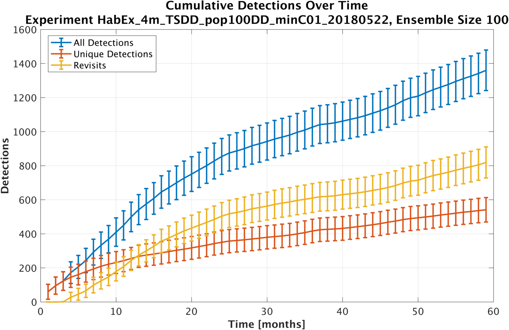
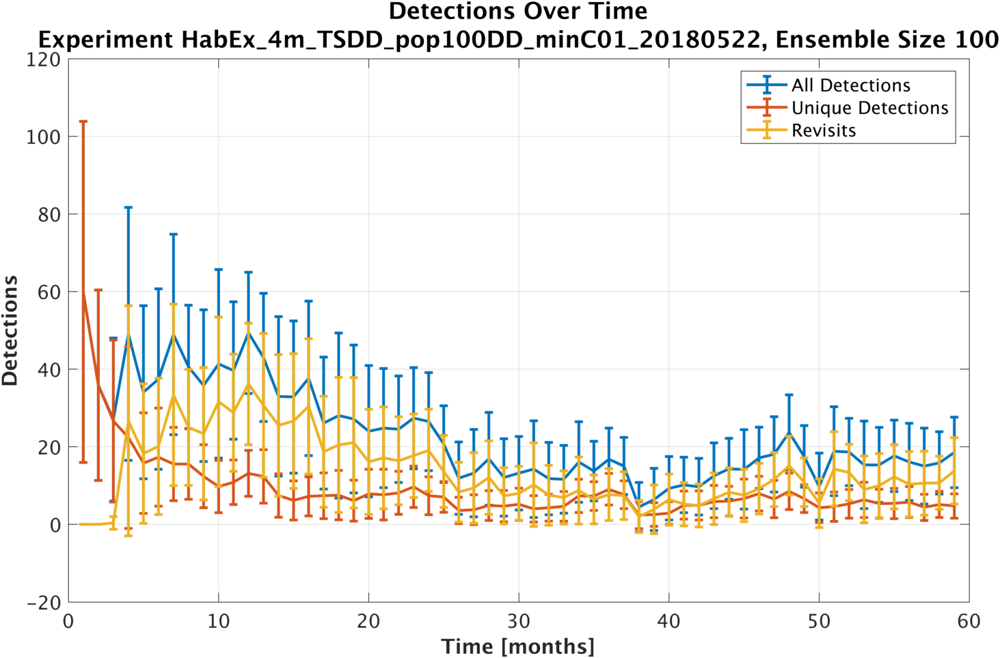
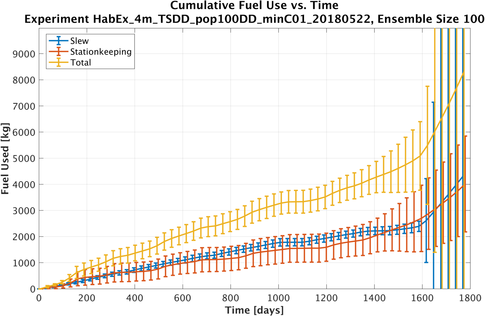
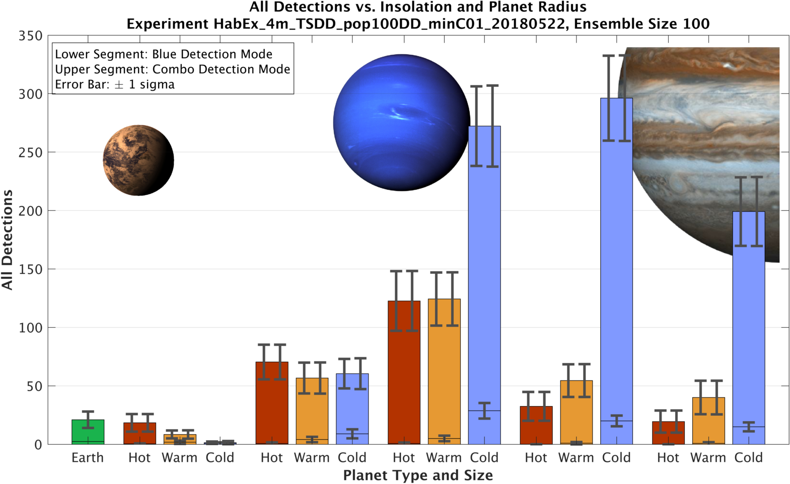
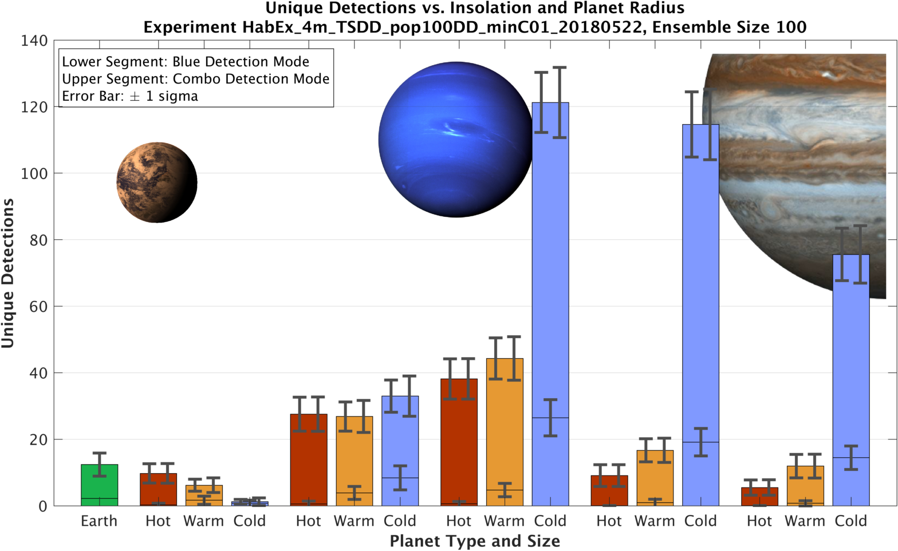
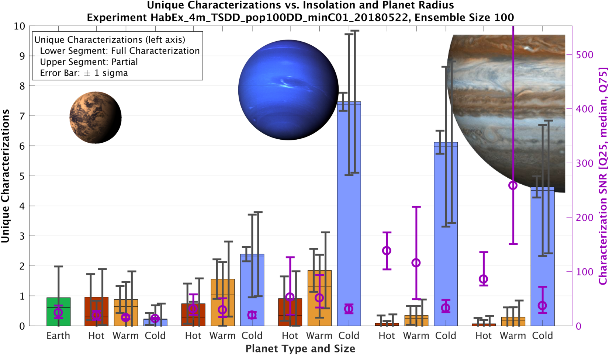

# Binned, Ensemble-based Plots

These are some of
the plots we make summarizing an ensemble
using compiled histograms.
Done using Matlab-based plotting of 
CSV files produced by `reduce-drms.py`.

## Detections vs. Time 

Cumulative detections.

[(Full size)](gfx/det-cume-detects.png)

Detections within one temporal bin.

[(full size)](gfx/det-detects.png)

## Fuel Use vs. Time 

[(Full size)](gfx/det-fuel.png)

## Radius/Luminosity Histograms

All detections.

[(Full size)](gfx/det-radlum-det-all.png)

Unique detections only.

 
[(Full size)](gfx/det-radlum-det.png) 

Characterizations.

[(Full size)](gfx/det-radlum-char.png)

