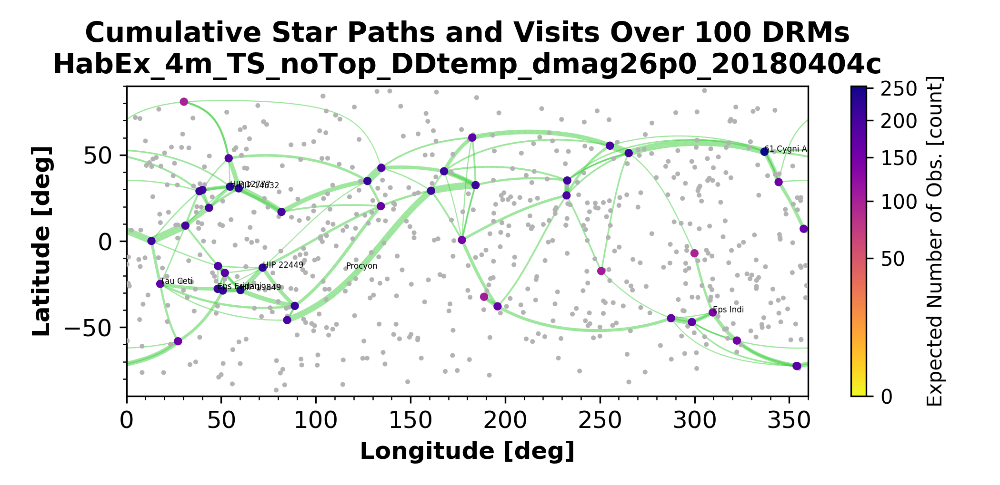
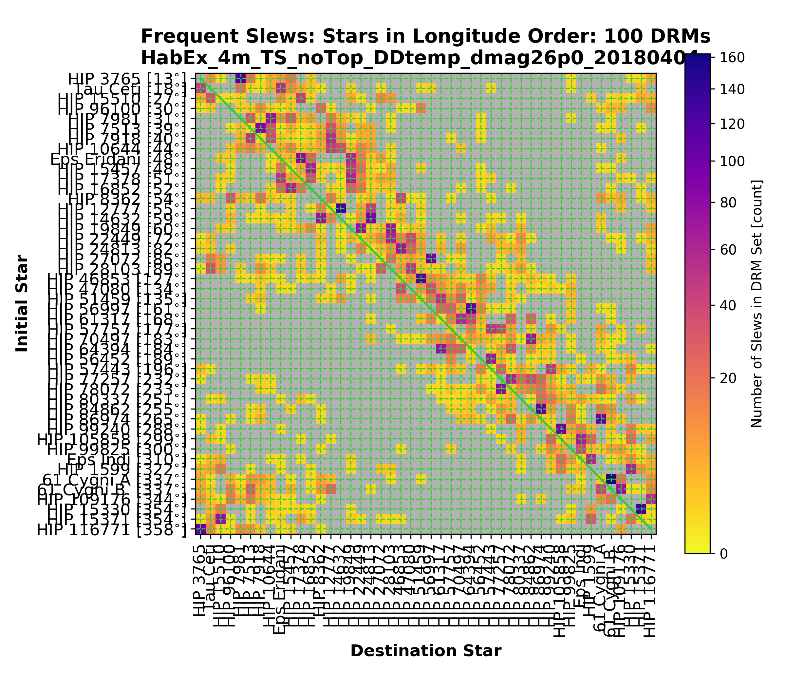
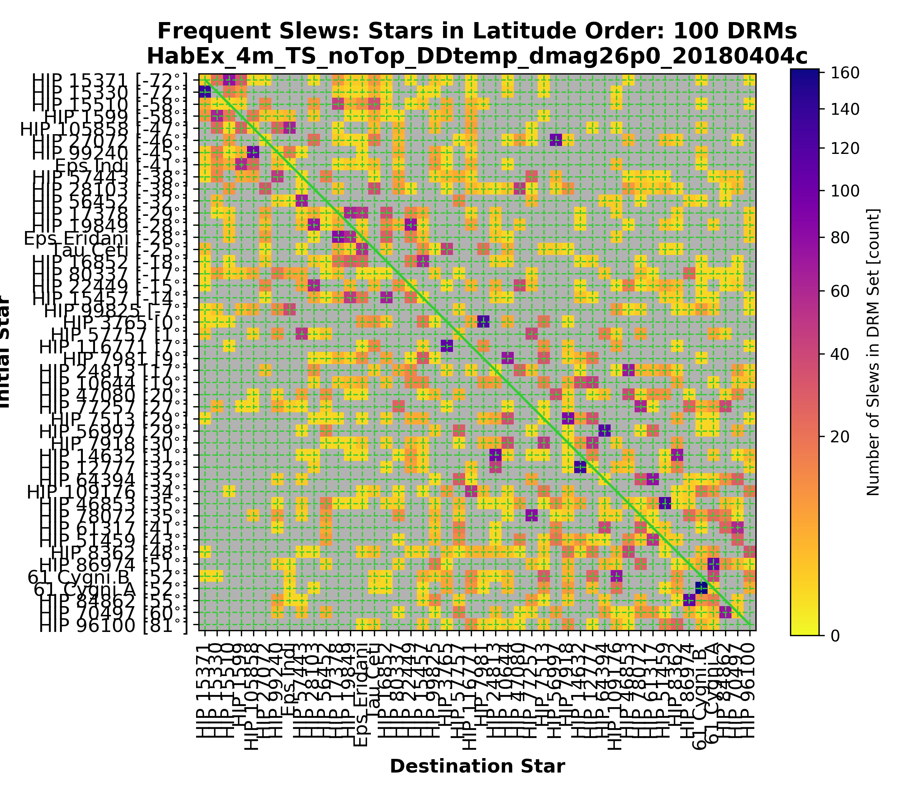

# Ensemble-based Path Plots

These are the plots we make summarizing an entire ensemble of slews.

## Map-format plot of activity

 
[(Full size)](path-ens/path-map.png) 

## Slews with targets ordered by longitude

 
[(Full size)](path-ens/path-adjacency-lon.png) 

## Slews with targets ordered by latitude

[(Full size)](path-ens/path-adjacency-lat.png)

