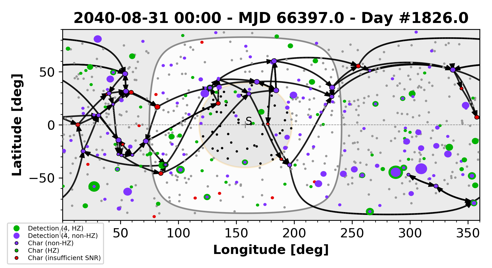

# Single-DRM Summary

We make a movie summarizing a single DRM: keepout, detections, and characterizations/slews.
We also output the final frame of the movie as a still image (PNG), which
summarizes
the whole DRM.

## Final Frame

 
[(Full size)](path-ens/path-map.png) 

## Movie

<a href="../path/124787829.mp4">Full Movie (mp4)</a>

## Text Summary

The `util/drm-ls.py` routine lists the number of detections in each drm
named.
Something like this should be in the Exosims distribution.

	$ util/drm-ls.py -l sims/HabEx_4m_TS_dmag26p0_20180206f/drm/17*.pkl
	DRM                            	Nobs	Ndet	Nchar	Nstar_det
	sims/HabEx_4m_TS_dmag26p0_20180206f/drm/170932699.pkl	703	1656	0	237
	sims/HabEx_4m_TS_dmag26p0_20180206f/drm/173338520.pkl	653	1529	0	235
	sims/HabEx_4m_TS_dmag26p0_20180206f/drm/175677805.pkl	655	1532	0	242
	sims/HabEx_4m_TS_dmag26p0_20180206f/drm/178486032.pkl	676	1586	0	250
	sims/HabEx_4m_TS_dmag26p0_20180206f/drm/178752841.pkl	698	1653	0	242
	*TOTAL                         	3385	7956	0	1206
	*MEAN                          	677.00	1591.20	0.00	241.20
	5 DRMs examined

