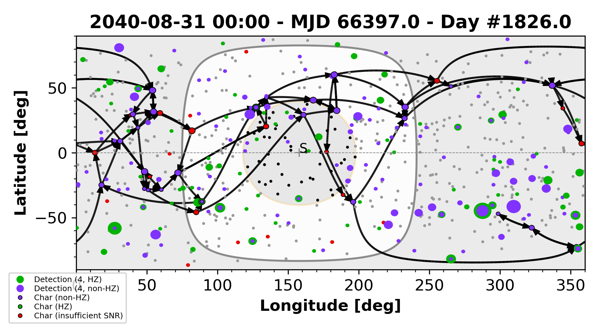

# Single-DRM Summary

We make a movie summarizing a single DRM: keepout, detections, and characterizations/slews.
We also output the final frame of the movie as a still image (PNG), which
summarizes
the whole DRM.

## Final Frame

 
[(Full size)](path-ens/path-map.png) 

## Movie

<a href="../path/124787829.mp4">Full Movie (mp4)</a>

## Text Summary

The `util/drm-ls.py` routine lists the number of detections in each drm
named, with a rollup (count and means) for each ensemble, and for each
family or experiment above it.  Use `-i` for a tree of run information
(time, EXOSIMS version and path) from the run logs.
Something like this should be in the Exosims distribution.

	$ util/drm-ls.py -l sims/HabEx_4m_TS_dmag26p0_20180206f/drm/17*.pkl
	DRM                                  Ndrm    Nobs  Ndet_ok  Nchar_ok  Nstar_det
	sims/HabEx_4m_TS_dmag26p0_20180206f     5  677.00  1591.20      0.00     241.20
	|- 170932699                                  703     1656         0        237
	|- 173338520                                  653     1529         0        235
	|- 175677805                                  655     1532         0        242
	|- 178486032                                  676     1586         0        250
	|- 178752841                                  698     1653         0        242

